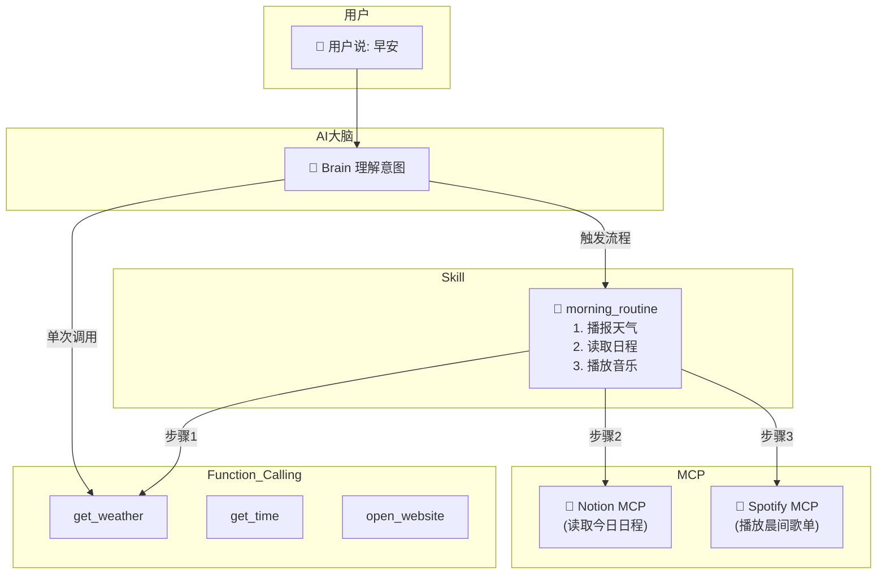
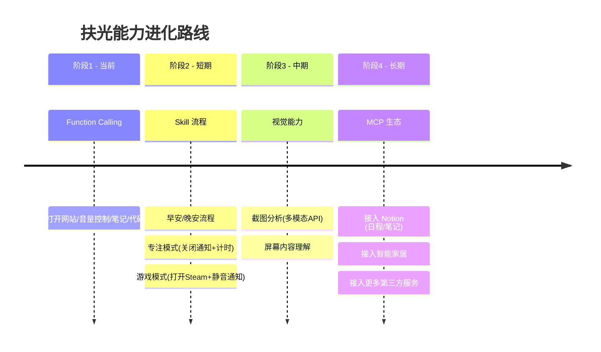

# 🎓 Function Calling vs Skill vs MCP 概念对比

> 这份文档专门为**扶光系统**编写，用你自己的代码来解释这三个概念。

---

## 🧠 一句话理解

| 概念 | 类比 | 核心作用 |
|:---:|:---:|:---|
| **Function Calling** | 📋 菜单上的单品 | AI 告诉系统"我要执行这个具体操作" |
| **Skill** | 📖 套餐/流程手册 | 把多个操作串成一个完整任务 |
| **MCP** | 🔌 USB 接口标准 | 让外部服务能即插即用地接入 AI |

---

## 📊 详细对比



---

## 1️⃣ Function Calling（扶光已实现 ✅）

### 是什么？
AI 把自然语言转换成**结构化的函数调用请求**。

### 在扶光中的实际例子

你的 `skills.py` 里定义的每个工具就是一个 Function：

```python
# 工具定义 (告诉 AI "你可以用这些工具")
_STATIC_TOOLS = [
    {
        "type": "function",
        "function": {
            "name": "search_web",           # 工具名
            "description": "联网搜索实时信息", # AI 看这个决定什么时候用
            "parameters": {
                "type": "object",
                "properties": {
                    "query": {"type": "string", "description": "搜索关键词"}
                },
                "required": ["query"]
            }
        }
    }
]

# 工具实现 (实际执行的代码)
def search_web(self, query: str) -> str:
    response = requests.post(url, json={"q": query}, ...)
    return "搜索结果..."
```

### 执行流程

```
用户: "帮我搜一下原神攻略"
         ↓
AI 输出: {"name": "search_web", "arguments": {"query": "原神攻略"}}
         ↓
Python: skill_manager.execute_tool("search_web", {"query": "原神攻略"})
         ↓
返回结果给 AI → AI 总结后回复用户
```

### 扶光现有的 Function Calling

| 工具名 | 功能 | 你的代码位置 |
|:---:|:---|:---|
| `search_web` | 联网搜索 | `skills.py:286` |
| `open_website` | 打开网站 | `skills.py:341` |
| `open_video` | B站视频搜索 | `skills.py:327` |
| `control_volume` | 音量控制 | `skills.py:357` |
| `set_reminder` | 定时提醒 | `skills.py:435` |
| `take_note` | 智能笔记 | `skills.py:520` |
| `write_code` | 代码生成 | `skills.py:563` |
| `open_tool` | 打开系统工具 | `skills.py:421` |

---

## 2️⃣ Skill（扶光可扩展 🔧）

### 是什么？
把多个 Function Calling **串联成一个有序流程**，像"剧本"一样执行。

### 与 Function Calling 的区别

| | Function Calling | Skill |
|:---:|:---:|:---:|
| 粒度 | 单个操作 | 一组操作 |
| 例子 | "打开B站" | "早安流程" |
| 触发 | AI 每次决策 | 关键词/定时触发 |

### 为扶光设计的 Skill 示例

如果你想实现"早安流程"，可以这样做：

```python
# 新增文件: src/fuguang/core/skill_flows.py

class SkillFlows:
    """扶光的技能流程"""
    
    def __init__(self, skills: SkillManager, mouth: Mouth):
        self.skills = skills
        self.mouth = mouth
    
    def morning_routine(self):
        """🌅 早安流程"""
        # 步骤1: 播报时间
        time_info = self.skills.get_time()
        self.mouth.speak(f"早上好指挥官，{time_info}")
        
        # 步骤2: 查询天气
        weather = self.skills.search_web("今天天气")
        self.mouth.speak(f"今天的天气是...{weather[:50]}")
        
        # 步骤3: 打开常用网站
        self.skills.open_website("B站")
        
        self.mouth.speak("早安流程完成，祝指挥官今天顺利！")
    
    def goodnight_routine(self):
        """🌙 晚安流程"""
        self.mouth.speak("晚安指挥官，正在关闭工作相关应用...")
        # ... 关闭应用、总结今日、设置明天闹钟等
```

然后在 `nervous_system.py` 中触发：

```python
# 检测到用户说"早安"
if "早安" in user_input or "起床" in user_input:
    skill_flows.morning_routine()
```

---

## 3️⃣ MCP（未来可接入 🚀）

### 是什么？
**Model Context Protocol** —— 一种标准化的接口协议，让 AI 能够与**外部服务**无缝对接。

### 与 Function Calling 的区别

| | Function Calling | MCP |
|:---:|:---:|:---:|
| 定义方 | 你自己写 | 第三方提供 |
| 维护方 | 你自己维护 | 第三方维护 |
| 例子 | `skills.py` 里的函数 | Notion官方提供的MCP Server |

### 理解方式

```
Function Calling:  你自己造一个充电器       （为特定设备定制）
MCP:              厂商提供的Type-C充电线    （即插即用的标准接口）
```

### 为扶光设计的 MCP 扩展场景

| MCP Server | 提供方 | 扶光可以... |
|:---:|:---:|:---|
| `notion-mcp` | Notion 官方 | "帮我记到 Notion 里" → 直接写入你的工作区 |
| `spotify-mcp` | Spotify | "播放我的歌单" → 控制 Spotify 播放 |
| `home-assistant-mcp` | 智能家居 | "关灯" → 控制你家的小米/HomeKit设备 |
| `file-system-mcp` | 社区 | "整理我的下载文件夹" → 自动分类文件 |

### 接入 MCP 的架构变化

```
当前架构:
用户 → AI(大脑) → skills.py(你写的函数) → 执行

接入MCP后:
用户 → AI(大脑) → MCP 协议层 → Notion/Spotify/智能家居...
                      ↘
                    skills.py (本地功能)
```

---

## 📌 扶光开发路线图建议



---

## 🎯 快速决策指南

当你想给扶光添加新功能时：

| 场景 | 选择 | 原因 |
|:---|:---:|:---|
| 单一操作（查天气、开网站） | Function Calling | 简单直接 |
| 固定流程（早安、专注模式） | Skill | 多步骤串联 |
| 对接第三方服务（Notion、Spotify） | MCP | 标准化、易维护 |
| 还不确定 | 先写 Function Calling | 可以后续升级为 Skill |
